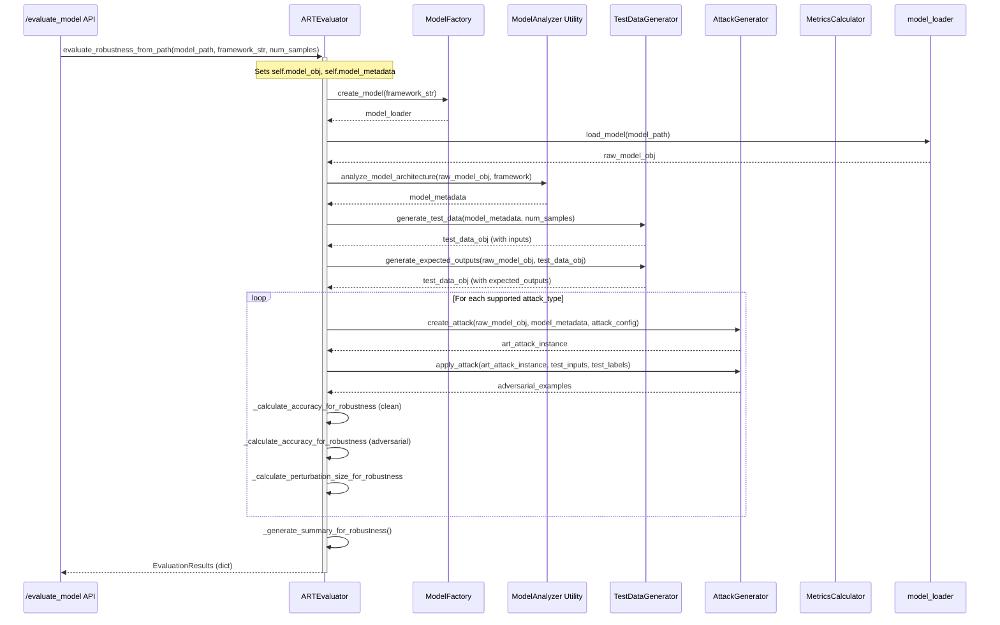

# Auto-ART: Automated Adversarial Robustness Testing Framework

Auto-ART is a Python framework designed for the comprehensive testing and evaluation of machine learning model robustness against a variety of adversarial threats. Built upon the [Adversarial Robustness Toolbox (ART)](https://github.com/Trusted-AI/adversarial-robustness-toolbox), Auto-ART provides a streamlined, extensible, and automated approach to assessing model vulnerabilities.

## Framework Overview

The core of Auto-ART revolves around a sophisticated `ARTEvaluator` capable of performing detailed security assessments. It supports:
- Evaluation of pre-loaded model objects with fine-grained configuration.
- A simplified evaluation flow where models are loaded from a path and assessed against a default suite of attacks.
- Integration of various attack categories including evasion, poisoning, extraction, and inference attacks.
- Basic evaluation of defensive measures.

The framework emphasizes modularity, with clear separation for attack implementations, model handlers, evaluation logic, and configuration.

### Visual Overview

#### High-Level Architecture

The following diagram illustrates the main components of Auto-ART and their interactions:

```mermaid
graph TD
    subgraph User Interaction
        CLI[CLI / SDK User]
        APIUser[API User]
    end

    subgraph Configuration
        EvalConfig[EvaluationConfig]
        GlobalConfig[Global ConfigManager]
    end

    subgraph Core Engine
        Evaluator(ARTEvaluator)
    end

    subgraph Core Components
        ModelLoader[Model Loaders (via Factory)]
        ModelAnalyzer[ModelAnalyzer Utility]
        DataGen[TestDataGenerator]
        AttackGen[AttackGenerator]
        ClassifierFac[ClassifierFactory]
        MetricsCalc[MetricsCalculator]
    end

    subgraph ART & Models
        ARTLib[Adversarial Robustness Toolbox (ART)]
        VictimModel[User's ML Model (PyTorch, TF, etc.)]
        AttackImpl[ART Attacks / Auto-ART Wrappers]
    end

    CLI --> Evaluator
    APIUser --> APIEndpoint(API /evaluate_model)
    APIEndpoint --> Evaluator

    Evaluator -- uses --> EvalConfig
    Evaluator -- uses --> GlobalConfig
    Evaluator -- uses --> ModelLoader
    Evaluator -- uses --> ModelAnalyzer
    Evaluator -- uses --> DataGen
    Evaluator -- uses --> AttackGen
    Evaluator -- uses --> ClassifierFac
    Evaluator -- uses --> MetricsCalc

    ModelLoader --> VictimModel
    ClassifierFac -- wraps --> VictimModel
    ClassifierFac --> ARTLibEst(ART Estimator)
    AttackGen -- creates --> AttackImpl
    AttackImpl -- uses --> ARTLibEst
    AttackImpl -- uses --> ARTLib

    Evaluator --> Report([Evaluation Report / Results])

    classDef user fill:#c9d4ff,stroke:#333,stroke-width:2px;
    classDef core fill:#f9f,stroke:#333,stroke-width:2px;
    classDef component fill:#bbf,stroke:#333,stroke-width:2px;
    classDef external fill:#f8c,stroke:#333,stroke-width:2px;
    classDef data fill:#ffc,stroke:#333,stroke-width:2px;

    class CLI,APIUser user;
    class Evaluator,APIEndpoint core;
    class ModelLoader,ModelAnalyzer,DataGen,AttackGen,ClassifierFac,MetricsCalc,EvalConfig,GlobalConfig component;
    class ARTLib,VictimModel,AttackImpl,ARTLibEst external;
    class Report data;
```

## Features

- **Unified Evaluation Engine**: `ARTEvaluator` consolidates evaluation workflows, offering flexibility for different use cases.
- **Broad Attack Arsenal**: Supports a wide range of attacks:
    - **Evasion Attacks**: Attempts to cause misclassifications at inference time (e.g., FGSM, PGD, C&W, AutoAttack, Boundary Attack).
    - **Poisoning Attacks**: Corrupts training data to implant backdoors or degrade performance (e.g., Backdoor, Clean Label, Feature Collision, Gradient Matching).
    - **Model Extraction Attacks**: Attempts to steal or replicate a model (e.g., Copycat CNN, Knockoff Nets, Functionally Equivalent Extraction).
    - **Inference Attacks**: Aims to deduce sensitive information about data or the model (e.g., Membership Inference, Attribute Inference, Model Inversion).
    - **LLM Attacks**: Specific attacks targeting Large Language Models (e.g., HotFlip).
- **Model Agnostic**: Designed to work with various ML frameworks (PyTorch, TensorFlow/Keras, scikit-learn, etc.) through a common model interface. (Note: Full support for all frameworks is an ongoing effort).
- **Configurable Evaluations**: Utilizes `EvaluationConfig` for detailed control over evaluation parameters, including attack settings and metrics.
- **Defence Evaluation**: Basic support for applying and evaluating the impact of defenses on model accuracy.
- **Extensible Design**: Easily add new attacks, defenses, model handlers, or metrics.
- **Improved Code Quality**: Recent refactoring efforts have focused on enhancing documentation, code clarity, and adherence to best practices.

## Installation

1.  Clone the repository:
    ```bash
    git clone https://github.com/yourusername/auto-art.git
    cd auto-art
    ```
    (Replace `yourusername` with the actual path if different)

2.  Install dependencies:
    ```bash
    pip install -r requirements.txt
    ```

## Usage Example (Conceptual)

The primary interface for evaluation is the `ARTEvaluator`.

```python
from auto_art.core.evaluation.art_evaluator import ARTEvaluator
from auto_art.core.evaluation.config.evaluation_config import EvaluationConfig, ModelType, Framework
# from auto_art.core.attacks.evasion import FastGradientMethodWrapper # Example for specific attack strategy if needed

# 1. Configure the evaluation
eval_config = EvaluationConfig(
    model_type=ModelType.CLASSIFICATION,
    framework=Framework.PYTORCH,
    # ... other parameters like input_shape, nb_classes, attack_params ...
)

# 2. Initialize the ARTEvaluator
# Option A: With a pre-loaded model object
# art_evaluator = ARTEvaluator(model_obj=your_pytorch_model, config=eval_config)
# results = art_evaluator.evaluate_model(test_data_np, test_labels_np, attacks=[...])

# Option B: Evaluate model from path (simpler, uses default attacks)
# This requires 'your_model_path' and 'your_model_framework' (e.g., "pytorch")
# The model_obj argument can be None if using this path.
art_evaluator_from_path = ARTEvaluator(model_obj=None, config=eval_config)
results_from_path = art_evaluator_from_path.evaluate_robustness_from_path(
    model_path="path/to/your/model.pt",
    framework="pytorch", # or "tensorflow", "keras", etc.
    num_samples=100
)

# 3. Generate a report or inspect results
# report_str = art_evaluator_from_path.generate_report(results_from_path)
# print(report_str)
# print(results_from_path)
```
*Note: The above `evaluate_model` usage with specific attack strategies requires defining those strategy objects. The `evaluate_robustness_from_path` method provides a more automated experience.*

#### Simplified Evaluation Workflow (`evaluate_robustness_from_path`)

This sequence diagram shows the typical flow when using `ARTEvaluator.evaluate_robustness_from_path`, for example, via the API:



## Project Structure

The project follows a modular structure:

```
auto_art/
├── api/                  # API endpoint definitions (e.g., Flask/FastAPI)
├── config/               # Global configuration management
├── core/                 # Core framework logic
│   ├── analysis/         # Model analysis utilities
│   ├── attacks/          # Attack algorithm implementations and wrappers
│   │   ├── evasion/
│   │   ├── poisoning/
│   │   ├── extraction/
│   │   ├── inference/
│   │   └── llm/
│   ├── base.py           # Base classes for core components
│   ├── evaluation/       # Evaluation engine, strategies, and configurations
│   │   ├── config/
│   │   ├── defences/
│   │   ├── factories/
│   │   └── metrics/
│   ├── interfaces.py     # Protocol definitions for components
│   └── testing/          # Test data generation utilities
├── implementations/      # Implementations for specific ML frameworks/libraries
│   └── models/           # Model handlers for different frameworks
├── utils/                # Common utility functions (logging, validation)
├── examples/             # (Conceptual) Example scripts and notebooks
└── ...
tests/                    # Unit, integration, and pipeline tests
├── unit/
├── integration/
└── pipeline/
```
All necessary directories are structured as Python packages with `__init__.py` files for improved importability and organization.

## Contributing

Contributions are welcome! Please fork the repository, make your changes, and submit a Pull Request. Ensure your code follows existing style conventions and includes appropriate tests and documentation.

## License

This project is licensed under the MIT License - see the `LICENSE` file for details (assuming one will be added).

## Acknowledgments

-   Built upon the [Adversarial Robustness Toolbox (ART)](https://github.com/Trusted-AI/adversarial-robustness-toolbox).
-   Inspired by the need for robust and automated evaluation of AI security.

## Detailed Documentation
For a comprehensive explanation of the codebase, refer to the [Detailed Overview](DETAILED_OVERVIEW.md) file.
```
